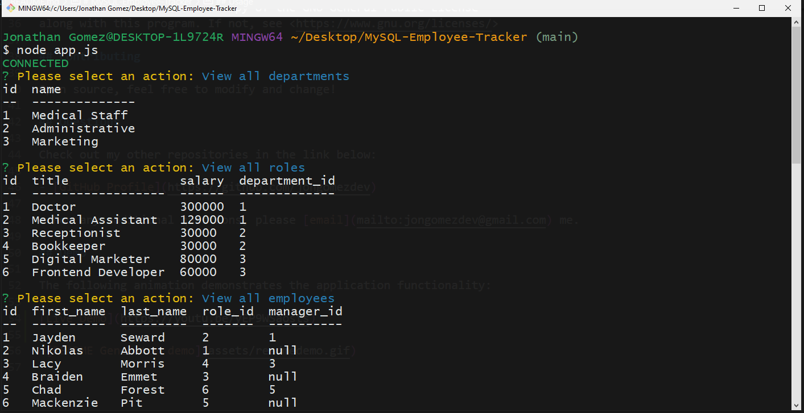

# MySQL-Employee-Tracker

## Description

A Content Management System that allows users to access information stored in a workplace database and manage employee's using node, inquirer and MySQL.

## Table of Contents

- [Installation](#installation)
- [Usage](#usage)
- [License](#license)
- [Contributing](#contributing)
- [Questions](#questions)

## Installation

Clone the repo and run `npm install` for the required dependencies

## Usage

Application will be invoked by using the `node app.js` command in the terminal. CLI functionality allows the user to add a department, role & employee. You can also edit an existing employee role.

## License

This program is free software: you can redistribute it and/or modify
it under the terms of the GNU General Public License as published by
the Free Software Foundation, either version 3 of the License, or
(at your option) any later version.
This program is distributed in the hope that it will be useful,
but WITHOUT ANY WARRANTY; without even the implied warranty of
MERCHANTABILITY or FITNESS FOR A PARTICULAR PURPOSE.See the
GNU General Public License for more details.
You should have received a copy of the GNU General Public License
along with this program. If not, see <https://www.gnu.org/licenses/>

## Contributing

Open source, feel free to modify and change! Please share the results.

## Questions

Check out my other repositories in the link below:

- [GitHub Profile](https://github.com/jongomezdev)

- For any additional questions, please [email](mailto:jongomezdev@gmail.com) me.

## Demo

The following animation demonstrates the application functionality:

[Live Demo](https://youtu.be/yEP9WSaosts)

